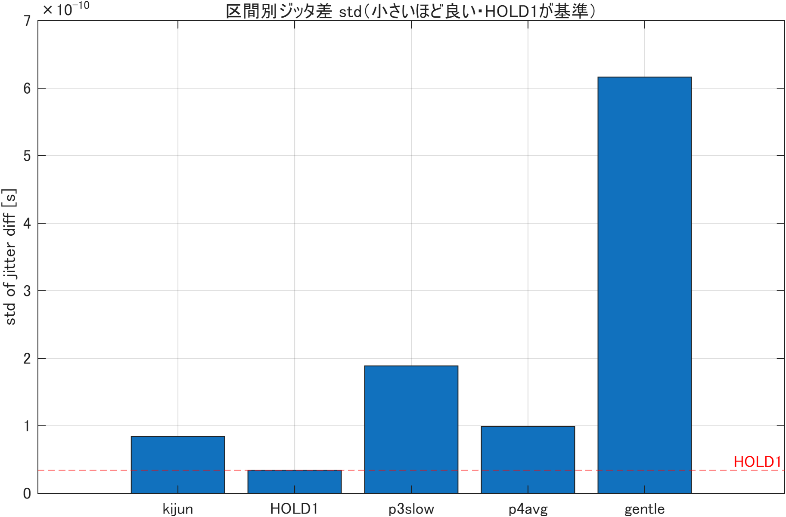
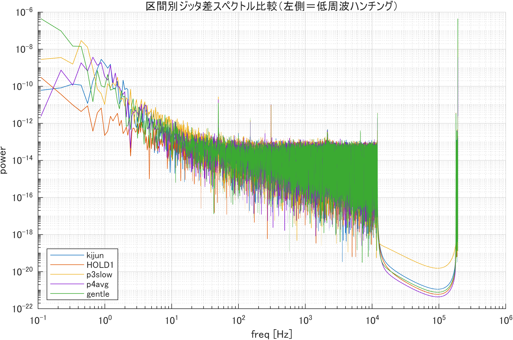

# 2026/06/04 実験報告：フィードバック制御の設定がOCXO位相同期精度に与える影響

## 0. 要約（先に結論）

2台のOCXO（10MHz水晶発振器）の位相同期において、**フィードバック（FB）制御の効かせ方を5条件で比較**した。

- **最も精度が良かったのは「制御をかけない（電圧固定）」状態（ジッタ std ≈ 34 ps）**。すなわち**FB制御は短期的にはむしろ位相を乱している**ことが定量的に確認できた。
- 「電圧の変化を減らせば位相の乱れが減るはず」という仮説のもと、**制御を遅くする／読み値を平均する／不感帯（デッドバンド）を入れる**の3つを試したが、**いずれも基準FBより精度が悪化**した（特に全部入りの "gentle" は基準の約7倍悪化）。
- 一方、**電圧固定（無制御）は5分間で大きく周波数ドリフトする**ため、長期同期にはFBが不可欠である。
- 結論：**短期ジッタ低減のために制御を「緩める」方向は逆効果**。次は制御の緩急ではなく、ハード側（出力電圧の1/10分圧など、1回の補正あたりの位相外乱を下げる）で攻めるべき。

> 注：本結果は **各条件1回のみ（スクリーニング段階）** の測定であり、傾向の確認が目的。確定には反復測定が必要。

---

## 1. 背景・目的

- 本研究は2台のOCXOを位相同期（周波数ロック）させることを目標とする。一方の発振器に制御電圧を加え、2台の位相差を一定に保つ。
- これまでの計測で、**FB制御を効かせている間は位相差にゆっくりした揺れ（約0.6 Hz のうねり）が生じ、電圧を固定して放置した区間より精度が悪い**ことが分かっていた。
- 仮説：**制御電圧を動かすこと自体が発振周波数を揺らし、位相を乱している**。ならば「電圧の変化量・頻度を減らせば」精度が上がるのではないか。
- 本実験では、この仮説を検証するため、FB制御の設定を変えた5条件を1回の連続録音で比較した。

---

## 2. 実験方法

### 2.1 装置構成

| 機器 | 役割 |
|------|------|
| OCXO ×2（10 MHz） | 基準側・制御側。制御側に電圧を加えて周波数を微調整 |
| NI DAQ (ao0) | 制御電圧（0–5 V）を出力 |
| オシロ SIGLENT SDS2204X | 2台の位相差（FRFR [ns]）をリアルタイム計測（制御に使用） |
| TASCAM DR-100MK3 | 2台の波形をステレオ録音（48 kHz付近の分周信号、192 kHz サンプリング）。**精度評価用** |

- **制御に使う計測**：オシロの位相差 FRFR（ns単位、粗い）。これを見てMATLABが電圧を更新。
- **精度評価に使う計測**：録音波形（fs=192 kHz）。後処理でヒルベルト変換し、2台の真の位相差（ジッタ）を ps レベルで算出。

### 2.2 測定シーケンス（1回の連続録音、約25分）

録音を回しっぱなしにし、MATLABで自動シーケンスを1回実行。**録音は制御開始の約10秒前から開始**（録音と制御の時刻合わせの基準）。

| No | 区間名 | 制御 | 設定の違い | 区間 |
|----|--------|------|-----------|------|
| 1 | kijun  | FB あり | **基準**（更新0.3秒ごと、読み1回、補正制限0.05V） | 0–5分 |
| 2 | HOLD1  | **なし** | 電圧を固定して放置（＝制御を切った基準状態） | 5–10分 |
| 3 | p3slow | FB あり | **制御をゆっくり**（更新を1.0秒ごとに） | 10–15分 |
| 4 | p4avg  | FB あり | **読み値を平均**（オシロを5回読んで中央値） | 15–20分 |
| 5 | gentle | FB あり | **全部入り**（ゆっくり＋平均＋不感帯0.5ns＋補正制限0.01V） | 20–25分 |

- No1で同期させた後、No2で電圧を固定（基準）。No3〜5はNo1の状態から継続して設定だけ変更。
- いずれも目標位相差 −75 ns（25 ns相当）に対して制御。

### 2.3 評価方法（録音の解析）

- 各区間の**中央付近の約10秒**を切り出し、ヒルベルト変換で各chの瞬時位相を求める。
- 直線（平均周波数）を差し引いた残差＝**位相ジッタ**を 0–12 kHz に帯域制限。
- 2ch のジッタ差 `sa` を取り、**その標準偏差 std [秒]** を精度指標とする（小さいほど同期が良い）。
- あわせてジッタ差のスペクトルを見て、**0.2〜2 Hz の低周波ピーク（うねり＝ハンチング）**の大きさを比較。
- 解析スクリプト：`hilbert_20260604.m`（全区間を自動処理・自動保存）。

---

## 3. 結果

### 3.1 主結果：ジッタ差の標準偏差（録音解析）

| No | 区間 | 制御 | **ジッタ std** | 低周波ピーク周波数 | 基準FB比 |
|----|------|------|---------------|------------------|---------|
| 1 | kijun  | FB基準 | 84 ps | 0.88 Hz | 1.0倍 |
| 2 | **HOLD1** | **無制御** | **34 ps（最良）** | 0.22 Hz | 0.41倍 |
| 3 | p3slow | ゆっくり | 189 ps | 0.44 Hz | 2.2倍（悪化） |
| 4 | p4avg  | 平均 | 99 ps | 0.66 Hz | 1.2倍（悪化） |
| 5 | gentle | 全部入り | **616 ps（最悪）** | 0.22 Hz | 7.3倍（悪化） |

精度の順位（良い→悪い）：**HOLD1（無制御） < kijun（基準FB） < p4avg < p3slow < gentle**

> スペクトル図の左側（低周波）に注目。制御を緩めた条件（p3slow, gentle）ほど低周波の山が高い＝うねりが大きい。

### 3.2 補足：制御側（オシロ）の挙動

各区間の制御電圧の総移動量と、オシロ位相差の標準偏差（5分間全体）。

| No | 区間 | 電圧総移動量 | オシロFRFR std（5分） | 備考 |
|----|------|------------|---------------------|------|
| 1 | kijun  | 0.97 V | 4.46 ns | 序盤に同期へ引き込む過渡を含む |
| 2 | HOLD1  | 0 V（固定）| **14.9 ns** | **無制御のため5分で大きくドリフト** |
| 3 | p3slow | 0.14 V | 5.05 ns | |
| 4 | p4avg  | 0.82 V | **0.15 ns** | オシロ上は最も安定 |
| 5 | gentle | 0.13 V | 0.56 ns | 電圧はほとんど動かさない |

ポイント：
- **HOLD1（無制御）はオシロ上で5分間に std 14.9 ns も漂う** → 長期的にはロックが外れる。FBが必要な理由。
- gentle は狙い通り電圧をほとんど動かさない（移動量0.13 V）が、それでも録音ジッタは最悪。**「電圧を動かさない＝精度が良い」ではない**。

---

## 4. 考察

1. **FB制御は短期ジッタを増やす**：無制御（HOLD1, 34 ps）が最良で、基準FB（84 ps）より良い。制御電圧の更新そのものが位相を小刻みに揺らしている、という当初の見立ては正しい。

2. **しかし制御を「緩める」と逆に悪化する**：
   - 更新を遅く（p3slow）、不感帯と微小ステップ（gentle）にすると、**補正が間に合わず／補正しない間に位相が自由にドリフト**し、低周波のうねりが増える（スペクトルの低域ピークが10〜34倍に増大）。
   - 結果、gentle は基準の約7倍悪化。**「電圧変化を最小化する」仮説は、短期ジッタについては否定された**。

3. **無制御は長期ドリフトするためFBは不可欠**：HOLD1はオシロ上で5分に14.9 ns 漂う。短期は良くても長期同期は保てない。
   → 本質的なトレードオフ：**FBは長期ドリフトを抑えるために必要だが、その補正が短期ジッタを生む**。

4. **したがって改善方向は「制御の緩急」ではない**：緩めても締めても短期ジッタは下がらなかった。**1回の電圧補正あたりの位相外乱そのものを小さくする**必要がある。

---

## 5. 結論と次の方針

- **結論**：制御の遅延・平均・不感帯といった「ソフト的に電圧変化を減らす」工夫では、OCXO位相同期の短期精度は改善しない（むしろ悪化）。短期精度の下限は無制御時の約34 ps、基準FBで約84 ps。
- **次の方針（ハード側）**：
  1. **出力電圧の1/10分圧回路**を入れ、同じ補正でも周波数（＝位相）への外乱を1/10にする（電圧分解能10倍）。← 最有力
  2. サムアンプ／ミキサー構成の検討。
- あわせて、本結果は**各条件1回のみ**なので、有力構成については**反復測定（5〜10回）**で確定させる。

---

## 6. 限界・注意点

- **各条件1回のみ**の測定（スクリーニング段階）。統計的な確定ではない。
- 5条件を1回の連続録音で順に測ったため、**測定順（時間経過による温度ドリフト）の影響**を完全には排除できていない（ただし精度は測定順と単調でなく、設定依存性が主と判断）。
- 評価窓は各区間中央の約10秒。より長い窓での確認が望ましい。
- 録音と制御の時刻合わせは「録音が約10秒先行」を仮定（±数秒の誤差は5分区間中央のため影響なし）。

---

## 7. 関連ファイル（このフォルダ内）

| 種類 | ファイル |
|------|---------|
| 制御シーケンス（本番実行） | `frfr_phase2_sequence_260604_v1.m` |
| 本番ログ／区間時刻表 | `frfr_phase2_seq_20260604_183831.csv` / `_segmap.csv` |
| 録音データ | `260604_0026.wav`（192 kHz ステレオ, 約31分） |
| ジッタ自動解析 | `hilbert_20260604.m`（依存 `bwlimit3.m`） |
| ジッタ数値一覧 | `260604_jitter_summary.csv` |
| 区間別図 | `260604_no1_kijun_*.png` 〜 `260604_no5_gentle_*.png`（spectrum/jitter） |
| 比較図 | `260604_compare_std.png` / `260604_compare_spectrum.png` |
